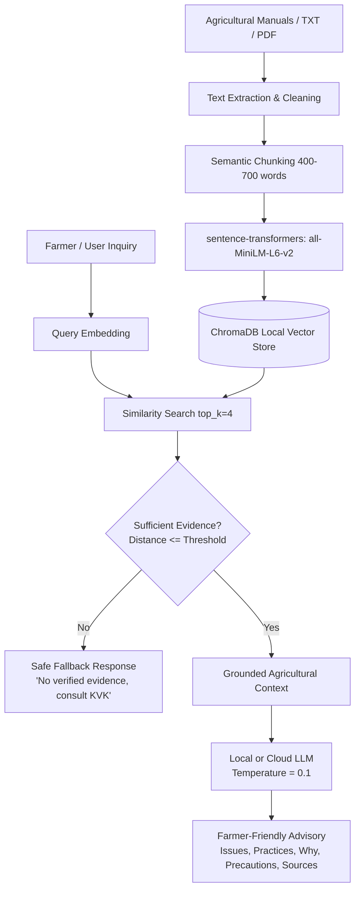

# BioShield AI — Natural Farming Pest Advisory Assistant

> **Program:** 1M1B AI for Sustainability Virtual Internship — IBM SkillsBuild & AICTE  
> **Primary SDG:** SDG 15 — Life on Land  
> **Secondary SDG:** SDG 12 — Responsible Consumption and Production  
> **Architecture:** Simple Document-Grounded RAG (Retrieval-Augmented Generation)

---

## 1. Executive Overview

### Problem
Farmers transitioning toward natural/sustainable farming may need accessible, understandable information about pest management.

### Solution
BioShield AI provides a grounded agricultural advisory workflow:
User query → embedding → ChromaDB retrieval → evidence threshold → LLM Inference → grounded advisory → source attribution

### Why AI?
AI is used to:
- retrieve relevant agricultural information
- synthesize retrieved evidence
- convert technical guidance into understandable language
- expose uncertainty
- provide source-linked decision support

*BioShield AI does not independently discover new agricultural knowledge.*

### Key Responsible-AI Principle
> **Zero Fabrication Policy:** If verified agricultural evidence is missing or below the similarity threshold, BioShield AI explicitly refuses to invent remedies or dosage amounts, triggering a safe fallback message instead.

---

## 2. SDG Alignment

- **SDG 15 — Life on Land:**  
  Protects soil vitality, beneficial insect populations, and terrestrial ecosystems by recommending cultural, preventive, and biological alternatives to harmful synthetic agrochemicals.
- **SDG 12 — Responsible Consumption and Production:**  
  Encourages lower-chemical inputs and promotes safe, sustainable natural farming practices.

---

## 3. Architecture



---

## 4. Technology Stack

- **Runtime:** Python 3.11
- **User Interface:** Streamlit
- **Vector Database:** ChromaDB (local persistence, no external vector cloud needed)
- **Embedding Model:** `sentence-transformers/all-MiniLM-L6-v2`
- **Inference LLM:** Local (Ollama) or Cloud (Groq) Provider
- **Document Processing:** `pypdf` + custom token chunker
- **Environment Management:** `python-dotenv`
- **Testing:** `pytest`

---

## 5. Knowledge Base

The knowledge base relies on 5 core natural farming sources:
1. **Field Guide for Natural Farming**: Provides foundational principles and holistic field-level practices.
2. **Generic Protocols for Natural Farming**: Supplies standard operational procedures and best practices for sustainable farming.
3. **Gujarat Natural Farming Science University — Natural Farming Package of Practices**: Offers localized, scientifically-backed practices for various crops.
4. **Pest and Disease Management in Natural Farming**: Specifically covers non-synthetic pest control methods and biological treatments.
5. **Natural Farming Training Toolkit**: Serves as an educational resource to translate protocols into actionable advice.

*(Note: Certain downloaded documents were intentionally excluded from the default corpus to avoid overlap or conflicts with natural farming approaches. The ICAR Kharif Agro-Advisories document is treated separately because it contains broader crop advisories, including conventional recommendations.)*

---

## 6. Directory Structure

```text
BioShield/
├── .env.example              # Template environment variables
├── .gitignore                # Git exclusions (.env, chroma_db, caches)
├── pytest.ini                # Pytest configuration
├── requirements.txt          # Python dependencies
├── README.md                 # Project documentation
├── ingest.py                 # Root CLI ingestion entrypoint
├── app.py                    # Streamlit web application
├── resources/                # Curated agricultural reference documents
│   ├── Field_Guide_for_Natural_Farming.pdf
│   ├── Generic Protocols for Natural Farming.pdf
│   ├── GujaratNaturalFarmingScienceUniversityGujarat.pdf
│   ├── PEST and DISEASE MANAGEMENT.pdf
│   └── Natural Farming Training Toolkit.pdf
├── data/
│   ├── raw/                  # Additional raw guidance documents
│   ├── secondary/            # Optional non-core/IPM guidance documents
│   └── processed/            # Processed text artifacts
├── chroma_db/                # Local ChromaDB vector database (generated on ingest)
├── docs/
│   ├── prd.md                # Comprehensive Product Requirements Document
│   └── plans/                # Phased development plans
├── src/
│   ├── __init__.py           # Package marker
│   ├── config.py             # Environment and directory configuration
│   ├── document_catalog.py   # Core vs secondary document registry & metadata
│   ├── chunking.py           # Section-aware and page-aware chunking
│   ├── embeddings.py         # Sentence-transformer embedding wrapper
│   ├── retriever.py          # Vector retrieval, scoring & evidence evaluation
│   ├── llm.py                # Inference clients (BaseLLM, FakeLLM, OllamaProvider, GroqProvider)
│   ├── prompts.py            # Grounded advisory prompts with XML delimiters & schema
│   ├── advisory_schema.py    # Structured advisory JSON schema & resilient parser
│   ├── ui_helpers.py         # UI helper utilities, error mapping, and demo presets
│   ├── ingest.py             # Idempotent document ingestion pipeline
│   ├── rag_pipeline.py       # End-to-end RAG workflow, gating & source verification
│   └── rag.py                # Public entrypoint exporting answer_query & schemas
└── tests/
    ├── test_config.py        # Environment & directory configuration tests
    ├── test_document_catalog.py # Corpus metadata & isolation tests
    ├── test_chunking.py      # Section & page-aware chunking tests
    ├── test_pdf_extraction.py # PDF extraction & error handling tests
    ├── test_ingest.py        # ChromaDB persistence & idempotency tests
    ├── test_retriever.py     # Source metadata, ranking & threshold tests
    ├── test_prompts.py       # Strict grounding rules & XML delimiter tests
    ├── test_llm.py           # LLM provider clients & error handling tests
    ├── test_advisory_schema.py # Structured output parsing & fallback tests
    ├── test_pipeline.py      # Evidence sufficiency & safe fallback tests
    ├── test_e2e_retrieval.py # End-to-end knowledge base retrieval tests
    ├── test_rag_integration.py # Live ChromaDB + LLM grounded RAG integration tests
    ├── test_ui_helpers.py    # UI helper & human-readable error formatting tests
    └── test_app_ui.py        # Streamlit AppTest automated UI rendering & interaction tests
```

---

## 7. Getting Started

### Step 1: Clone Repository & Create Virtual Environment

```bash
git clone https://github.com/Keval2609/BioShield.git
cd BioShield

# Create a Python 3.11 virtual environment
python -m venv .venv

# Activate the virtual environment
# On Windows PowerShell:
.venv\Scripts\Activate.ps1
# On Linux / macOS:
source .venv/bin/activate
```

### Step 2: Install Dependencies

```bash
pip install -r requirements.txt
```

### Step 3: Configure Environment Variables

Copy `.env.example` to `.env`:

```bash
copy .env.example .env     # Windows
cp .env.example .env       # Linux/macOS
```

Edit `.env` with your LLM configuration:

```env
# Example using local Ollama:
OLLAMA_MODEL=granite3.3:2b
OLLAMA_BASE_URL=http://localhost:11434

# Or using Groq Cloud API:
# GROQ_API_KEY=<your-api-key>
# GROQ_MODEL=llama-3.1-8b-instant

LLM_PROVIDER=ollama

EMBEDDING_MODEL=sentence-transformers/all-MiniLM-L6-v2
TOP_K=4
SIMILARITY_THRESHOLD=0.35
```

---

## 8. Running the Pipeline

### 1. Ingest Core Documents into Knowledge Base

Run the idempotent knowledge base ingestion pipeline:

```bash
python ingest.py
```

This will:
- Extract text page-by-page from the 5 core natural farming PDFs in `resources/`
- Perform section-aware chunking (~400–700 tokens, 50–100 token overlap)
- Preserve exact page numbers and document metadata
- Compute embeddings via `sentence-transformers/all-MiniLM-L6-v2`
- Persist vectors into local `chroma_db/` idempotently (rerunning will add 0 duplicate chunks)

### 2. Query via Python API (`src.rag`)

```python
from src.rag import answer_query

# Query the grounded pipeline
result = answer_query("How can I control stem borers in paddy using natural farming?")

if result.evidence_status == "INSUFFICIENT_EVIDENCE":
    print("Insufficient evidence:", result.get("message"))
else:
    print("Possible Issue:", result.get("possible_issue"))
    print("Confidence:", result.get("confidence"))
    print("Evidence-Based Practices:")
    for practice in result.get("evidence_based_practices", []):
        print(f" - {practice}")
    print("Verified Sources:")
    for src in result.get("sources", []):
        print(f" - {src['title']} (p. {src['page']}, {src['section']})")
```

### 3. Structured Advisory Format

When evidence is sufficient, the output strictly adheres to:
```json
{
  "possible_issue": "Target pest/disease description based strictly on context",
  "evidence_based_practices": ["Natural preparation / botanical spray / cultural control"],
  "why_relevant": "Explanation of mechanism grounded in the retrieved text",
  "precautions": ["Safety guidelines, dosage instructions if mentioned, or handling notes"],
  "sources": [
    {
      "title": "Field_Guide_for_Natural_Farming.pdf",
      "page": 42,
      "section": "Pest Management Protocols"
    }
  ],
  "confidence": "High | Medium | Low",
  "limitations": "Prototype advisory notice with recommendation to consult KVK / local extension officers"
}
```

If evidence distance exceeds `SIMILARITY_THRESHOLD`, the LLM is **not invoked**, immediately returning:
```json
{
  "status": "INSUFFICIENT_EVIDENCE",
  "message": "No sufficiently verified natural farming practice was found in the core knowledge base for your inquiry. Please consult your local Krishi Vigyan Kendra (KVK) or agricultural extension officer for safe recommendations.",
  "sources": [],
  "confidence": "Low"
}
```

### 4. Launch the Streamlit Web Application

Launch the interactive, responsible decision-support interface:

```bash
streamlit run app.py
```

The Streamlit UI features:
- **Responsible-AI Disclaimer:** Prominently highlights that BioShield AI is a decision-support prototype and advises verification with local KVK experts for severe crop problems.
- **3 Demo Mode Presets:** One-click buttons to populate inquiries for supported natural farming scenarios (cotton sucking pests, pigeon pea pod borer) or test safe refusal against synthetic chemical requests.
- **Structured 4-Field Input Form:** Crop, Observed symptom/problem, Farming approach (`Natural farming`, `Organic farming`, `Sustainable/IPM`), and User Question.
- **7-Section Advisory Presentation:** Possible Issue, Evidence-Based Practices, Why Relevant, Precautions, Sources, Evidence Confidence Badge, and Limitations.
- **Expandable Retrieved Evidence:** Transparently displays retrieved document titles, page numbers, sections, text passages, and cosine distance scores.
- **Responsible AI Sidebar:** Complete overview of safety guardrails and live ChromaDB chunk counters.
- **Human-Friendly Error Handling:** Explains missing configurations or unreachable endpoints cleanly without dumping raw Python stack traces.

### 5. Run Automated Tests

Execute the complete test suite:

```bash
pytest -v
```

All 53 unit, integration, schema, and UI tests will execute across:
- Configuration and document catalog isolation
- PDF extraction and chunking
- ChromaDB persistence and idempotency
- Vector similarity scoring and evidence threshold gating
- System prompts, grounding rules, and XML delimiter boundaries
- LLM provider inference, timeouts, and auth headers
- Structured advisory JSON schema validation and resilient fallback parsing
- Grounded RAG integration pipeline with source verification
- UI helper functions and human-readable exception mapping
- Automated Streamlit UI rendering and interaction flows (`streamlit.testing.v1.AppTest`)

---

## 9. Responsible AI & Limitations

BioShield AI operates under strict AI safety and responsibility constraints:
- **Grounding**: All recommendations must be explicitly supported by the retrieved context.
- **Source traceability**: Advisories include exact document, page, and section citations derived from the retrieval metadata.
- **Uncertainty**: The system transparently communicates confidence scores and limitations.
- **Hallucination prevention**: No fabricated facts, preparation methods, or sources are permitted.
- **Evidence threshold**: Queries with insufficient retrieved evidence trigger a safe fallback instead of speculative generation.
- **Safe fallback**: Recommends consulting an expert when the knowledge base lacks sufficient information.
- **No definitive diagnosis**: AI provides possibilities (e.g., "Symptoms may be consistent with..."), not absolute diagnoses.
- **No fabricated application rates**: The system refuses to invent unverified dosages or preparation ratios.
- **Human expert verification**: Always advises users to consult local agricultural extension officers or Krishi Vigyan Kendras (KVK).
- **Limitations of the knowledge base**: Acknowledges that the system's answers are strictly bounded by its limited document corpus.

### Limitations
- **Limited document corpus**: The current knowledge base is a restricted prototype subset.
- **No field validation**: The recommendations have not been systematically validated in the field.
- **No image-based diagnosis**: The system cannot analyze photographs of crops or pests.
- **No real-time weather information**: Recommendations do not account for current meteorological conditions.
- **No real-time pest surveillance**: Does not integrate with live pest tracking or early warning systems.
- **No guarantee of treatment effectiveness**: Recommendations are informational and not guaranteed to eliminate pests.
- **Not a substitute for agricultural experts**: Designed for decision support, not autonomous intervention.
- **Regional/crop-specific verification**: Local conditions may require verification of general natural farming practices.

---

## 10. Evaluation

Prototype evaluation using a small manually constructed test set.

| Test | Retrieval Relevant? | Grounded? | Source Correct? | Safe Behavior? | Result |
| --- | --- | --- | --- | --- | --- |
| 1. Supported Query | Yes | Yes | Yes | Yes | PASS |
| 2. Crop-Specific Query | Yes | Yes | Yes | Yes | PASS |
| 3. Unsupported Query | N/A | N/A | N/A | Yes | PASS |
| 4. Ambiguous Symptom | Yes | Yes | Yes | Yes | PASS |
| 5. Unsupported Dosage Request | Yes | Yes | Yes | Yes | PASS |

---

## 11. License

Developed for the **1M1B AI for Sustainability Virtual Internship** in collaboration with **IBM SkillsBuild** and **AICTE**. Distributed under the Apache 2.0 License.
