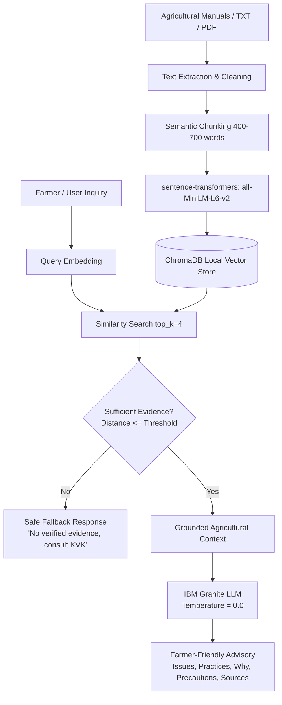

# BioShield AI — Natural Farming Pest Advisory Assistant

> **Program:** 1M1B AI for Sustainability Virtual Internship — IBM SkillsBuild & AICTE  
> **Primary SDG:** SDG 15 — Life on Land  
> **Secondary SDG:** SDG 12 — Responsible Consumption and Production  
> **Architecture:** Simple Document-Grounded RAG (Retrieval-Augmented Generation)

---

## 1. Executive Overview

**BioShield AI** is an AI-powered agricultural decision-support assistant that provides farmers and agricultural students with simple, trustworthy guidance on sustainable, biological, and natural pest-management practices.

A farmer inputs their crop, observed pest symptoms, and query. The system embeds the inquiry, retrieves relevant passages from a curated agricultural knowledge base stored in **ChromaDB**, and passes the grounded context to **IBM Granite** to synthesize a clear, safe, evidence-backed advisory.

### Key Responsible-AI Principle
> **Zero Fabrication Policy:** If verified agricultural evidence is missing or below the similarity threshold, BioShield AI explicitly refuses to invent remedies or dosage amounts, triggering a safe fallback message instead.

---

## 2. SDG Alignment

- **SDG 15 — Life on Land:**  
  Protects soil vitality, beneficial insect populations, and terrestrial ecosystems by recommending cultural, preventive, and biological alternatives to harmful synthetic agrochemicals.
- **SDG 12 — Responsible Consumption and Production:**  
  Encourages lower-chemical inputs and promotes safe, sustainable natural farming practices.

---

## 3. Architecture



---

## 4. Technology Stack

- **Runtime:** Python 3.11
- **User Interface:** Streamlit
- **Vector Database:** ChromaDB (local persistence, no external vector cloud needed)
- **Embedding Model:** `sentence-transformers/all-MiniLM-L6-v2`
- **Inference LLM:** IBM Granite (via OpenAI-compatible endpoint or local Ollama)
- **Document Processing:** `pypdf` + custom token chunker
- **Environment Management:** `python-dotenv`
- **Testing:** `pytest`

---

## 5. Directory Structure

```text
BioShield/
├── .env.example              # Template environment variables
├── .gitignore                # Git exclusions (.env, chroma_db, caches)
├── requirements.txt          # Python dependencies
├── README.md                 # Project documentation
├── app.py                    # Streamlit web application
├── data/
│   ├── raw/                  # Trusted agricultural guidance documents
│   │   └── sample_icar_pigeonpea.txt
│   └── processed/            # Processed text artifacts
├── chroma_db/                # Local ChromaDB vector database (generated on ingest)
├── docs/
│   ├── prd.md                # Comprehensive Product Requirements Document
│   └── prompts.md            # Reference development prompts
├── src/
│   ├── __init__.py           # Package marker
│   ├── config.py             # Environment configuration
│   ├── chunking.py           # Text cleaning and word chunking
│   ├── embeddings.py         # Sentence-transformer embedding wrapper
│   ├── retriever.py          # Vector retrieval and evidence evaluation
│   ├── llm.py                # IBM Granite inference client
│   ├── prompts.py            # Grounded advisory prompts
│   ├── ingest.py             # Idempotent document ingestion pipeline
│   └── rag_pipeline.py       # End-to-end RAG workflow & safe fallback
└── tests/
    ├── test_chunking.py      # Chunking & whitespace tests
    ├── test_retriever.py     # Threshold filtering tests
    └── test_pipeline.py      # Evidence sufficiency & safe fallback tests
```

---

## 6. Getting Started

### Step 1: Clone Repository & Create Virtual Environment

```bash
git clone https://github.com/your-username/BioShield.git
cd BioShield

# Create a Python 3.11 virtual environment
python -m venv .venv

# Activate the virtual environment
# On Windows PowerShell:
.venv\Scripts\Activate.ps1
# On Linux / macOS:
source .venv/bin/activate
```

### Step 2: Install Dependencies

```bash
pip install -r requirements.txt
```

### Step 3: Configure Environment Variables

Copy `.env.example` to `.env`:

```bash
copy .env.example .env     # Windows
cp .env.example .env       # Linux/macOS
```

Edit `.env` with your IBM Granite configuration:

```env
# Example using local Ollama serving Granite:
GRANITE_MODEL=ibm/granite-3-8b-instruct
GRANITE_BASE_URL=http://localhost:11434/v1
GRANITE_API_KEY=not-required-for-ollama

# Or using IBM watsonx / OpenAI-compatible endpoint:
# GRANITE_BASE_URL=https://<your-endpoint>/v1
# GRANITE_API_KEY=<your-api-key>

EMBEDDING_MODEL=sentence-transformers/all-MiniLM-L6-v2
TOP_K=4
SIMILARITY_THRESHOLD=0.35
```

---

## 7. Running the Pipeline

### 1. Ingest Documents into Knowledge Base

Place your authoritative agricultural PDF or TXT guides into `data/raw/`, then run:

```bash
python -m src.ingest
```

This will clean, chunk, embed, and store documents into `chroma_db/` idempotently.

### 2. Launch the Streamlit Web UI

```bash
streamlit run app.py
```

The application will open in your browser at `http://localhost:8501`.

### 3. Run Automated Tests

```bash
python -m pytest tests/
```

All tests for chunking, retriever filtering, and pipeline fallbacks will execute and validate.

---

## 8. Responsible AI & Safety Principles

1. **Evidence Grounding:** Recommendations are strictly derived from verified agricultural extension materials.
2. **No Dosage Fabrication:** The model is prohibited from inventing chemical mixtures, drug formulas, or pesticide ratios.
3. **Transparent Uncertainty:** The UI explicitly flags low-confidence responses and communicates evidence limitations.
4. **Human Escalation:** Farmers are advised to consult local Krishi Vigyan Kendra (KVK) scientists or certified extension officers for unverified or severe pest damage.
5. **Data Privacy:** No personal identifiable information (PII) or land-holding records are gathered.

---

## 9. License

Developed for the **1M1B AI for Sustainability Virtual Internship** in collaboration with **IBM SkillsBuild** and **AICTE**. Distributed under the Apache 2.0 License.
